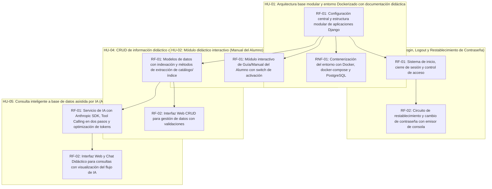

# Grafo de Dependencias -- django

_Generado automaticamente el 2026-09-24T18:59:56.113Z -- no editar a mano, se sobreescribe en cada publicacion._

```mermaid
graph TD
  subgraph US_1790269951533["HU-01: Arquitectura base modular y entorno Dockerizado con documentación didáctica"]
    REQ_1790271231287["RF-01: Configuración central y estructura modular de aplicaciones Django"]
    REQ_1790271332189["RNF-01: Contenerización del entorno con Docker, docker-compose y PostgreSQL"]
  end
  subgraph US_1790270031919["HU-02: Módulo didáctico interactivo (Manual del Alumno) con mecanismo de activación u ocultamiento"]
    REQ_1790271443931["RF-01: Módulo interactivo de Guía/Manual del Alumno con switch de activación"]
  end
  subgraph US_1790270167277["HU-03: Autenticación de usuarios (Login, Logout y Restablecimiento de Contraseña)"]
    REQ_1790271633298["RF-01: Sistema de inicio, cierre de sesión y control de acceso"]
    REQ_1790272080655["RF-02: Circuito de restablecimiento y cambio de contraseña con emisor de consola"]
  end
  subgraph US_1790270297472["HU-04: CRUD de información didáctico con indexación en base de datos PostgreSQL"]
    REQ_1790272254524["RF-01: Modelos de datos con indexación y métodos de extracción de catálogo/índice"]
    REQ_1790272349467["RF-02: Interfaz Web CRUD para gestión de datos con validaciones"]
  end
  subgraph US_1790270414974["HU-05: Consulta inteligente a base de datos asistida por IA (Anthropic API con optimización estricta de tokens)"]
    REQ_1790272467589["RF-01: Servicio de IA con Anthropic SDK, Tool Calling en dos pasos y optimización de tokens"]
    REQ_1790272536899["RF-02: Interfaz Web y Chat Didáctico para consultas con visualización del flujo de IA"]
  end
  REQ_1790271231287 --> REQ_1790271332189
  REQ_1790271231287 --> REQ_1790271443931
  REQ_1790271231287 --> REQ_1790271633298
  REQ_1790271633298 --> REQ_1790272080655
  REQ_1790271231287 --> REQ_1790272254524
  REQ_1790272254524 --> REQ_1790272349467
  REQ_1790272254524 --> REQ_1790272467589
  REQ_1790272467589 --> REQ_1790272536899
```