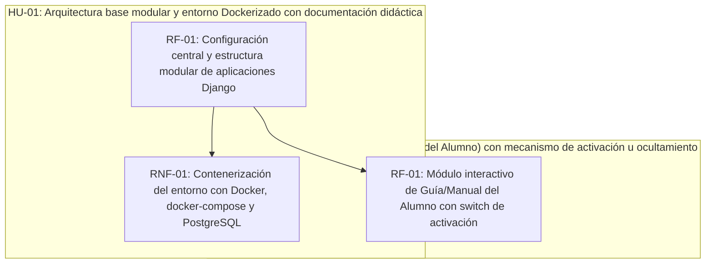

# Grafo de Dependencias -- django

_Generado automaticamente el 2026-09-24T17:37:37.778Z -- no editar a mano, se sobreescribe en cada publicacion._

```mermaid
graph TD
  subgraph US_1790269951533["HU-01: Arquitectura base modular y entorno Dockerizado con documentación didáctica"]
    REQ_1790271231287["RF-01: Configuración central y estructura modular de aplicaciones Django"]
    REQ_1790271332189["RNF-01: Contenerización del entorno con Docker, docker-compose y PostgreSQL"]
  end
  subgraph US_1790270031919["HU-02: Módulo didáctico interactivo (Manual del Alumno) con mecanismo de activación u ocultamiento"]
    REQ_1790271443931["RF-01: Módulo interactivo de Guía/Manual del Alumno con switch de activación"]
  end
  REQ_1790271231287 --> REQ_1790271332189
  REQ_1790271231287 --> REQ_1790271443931
```